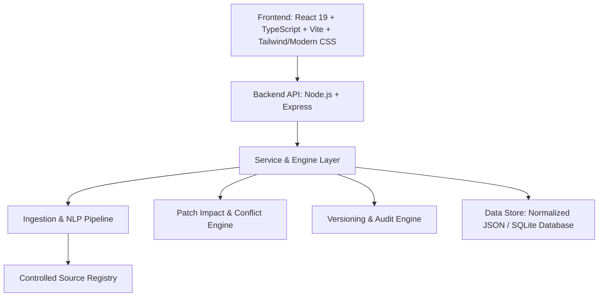

# POE2 BUILD HUB — Arquitetura do Sistema

## 1. Visão Geral
O **POE2 Build Hub** é uma plataforma modular de gestão de conhecimento para Path of Exile 2 (POE2), orientada a **fontes estritamente controladas** e **versionamento contínuo**.

A premissa imutável do sistema é:
> **Zero Alucinação / Fonte Controlada**: O sistema jamais adiciona, assume ou completa dados sem que estejam explicitamente presentes em uma fonte cadastrada e verificada pelo administrador.

---

## 2. Princípios de Engenharia
1. **Modularidade Desacoplada**: Cada domínio de negócio (Builds, Crafting, Farming, Patch Notes, Fontes) é um módulo independente.
2. **Versionamento Lógico Imutável**: Nenhuma versão anterior de build, item ou habilidade é apagada; todas são versionadas e vinculadas a um `Patch` e a uma `Source`.
3. **Rastreabilidade de Ponta a Ponta**: Toda informação exibida em UI possui atributos de auditoria (`source_id`, `excerpt`, `author`, `version_tag`, `conflict_flag`).
4. **Resolução Transparente de Conflitos**: Divergências entre fontes são destacadas explicitamente em vez de sobrescritas.
5. **IA Curadora (Não Autora)**: Funções de processamento de linguagem natural apenas extraem, normalizam, classificam e relacionam dados brutos das fontes.

---

## 3. Topologia Técnica

### 3.1 Camada de Apresentação (Frontend)
- **Stack**: React, TypeScript, Vite, Modern CSS com design tokens inspirados em Path of Exile 2 (Dark Fantasy, paleta âmbar/dourada `#d4a373`, ardósia `#0f1218` e bordas esculpidas).
- **Recursos**:
  - Catálogo de Builds com filtros de classe, ascendência, patch e arquétipo.
  - Inspetor detalhado de build com abas: Progressão, Habilidades, Passivas, Equipamentos, Crafting, Gameplay, Conflitos e Fontes.
  - Rastreador de Rotas de Farm (passo a passo, mecânicas, tempo, riscos).
  - Guia de Crafting interativo por etapas com custo e alternativas.
  - Analisador de Impacto de Patch Notes (Buffs, Nerfs, Entidades e Builds afetadas com tag `[REVISAR]`).
  - Painel de Administração de Fontes (Ingestão textual, links, transcrições de vídeos e status).
  - Global Search com índice cruzado e filtros contextuais.

### 3.2 Camada de Serviços & Lógica de Negócio (Backend)
- **Stack**: Node.js + Express + TypeScript/ESModules.
- **Módulos Principais**:
  - `SourceService`: Cadastro, validação, extração de texto e registro de proveniência.
  - `BuildService`: Agregação de builds, versões de árvore, progressão de leveling a endgame.
  - `PatchImpactService`: Varredura de alterações em patch notes cruzando com skills, passivas e builds ativas.
  - `ConflictService`: Comparação de entidades entre diferentes fontes e registro de divergências.
  - `SearchService`: Motor de indexação e busca multi-entidade.

### 3.3 Camada de Persistência
- Banco estruturado relacional e normalizado com suporte a versionamento (`BuildVersion`, `ItemVersion`, `SkillVersion`).
- Backing store em SQLite / JSON Storage auditável e pronto para migração para PostgreSQL corporativo.
