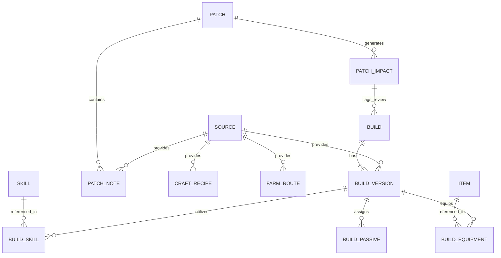

# POE2 BUILD HUB — Estratégia de Banco de Dados

## 1. Visão Geral do Banco de Dados
O banco de dados foi projetado sob os seguintes pilares:
1. **Normalização e Versionamento Lógico**: Entidades centrais possuem versões filhas (`Build` -> `BuildVersion`, `Item` -> `ItemVersion`, `Skill` -> `SkillVersion`).
2. **Imutabilidade Histórica**: Nenhuma linha histórica é deletada. O campo `status` ou `is_current` controla a visualização ativa.
3. **Chaves de Auditoria**: Toda tabela de dados possui relacionamento obrigatório com `Source` através de `source_id` e citação textual (`source_excerpt`).
4. **Resolução de Conflitos**: Tabela dedicada `SourceConflict` que armazena divergências entre fontes com seus respectivos IDs e valores.

## 2. Tabelas e Relacionamentos

## 3. Tipos de Armazenamento
- **Fase MVP / Desenvolvimento**: Storage estruturado em JSON Schema relacional ou SQLite, permitindo inicialização imediata sem dependências de servidores externos pesados.
- **Produção / Escalabilidade**: Mapeável 1:1 para PostgreSQL / CockroachDB com suporte a JSONB para árvores passivas complexas e índices GIN de busca full-text.
