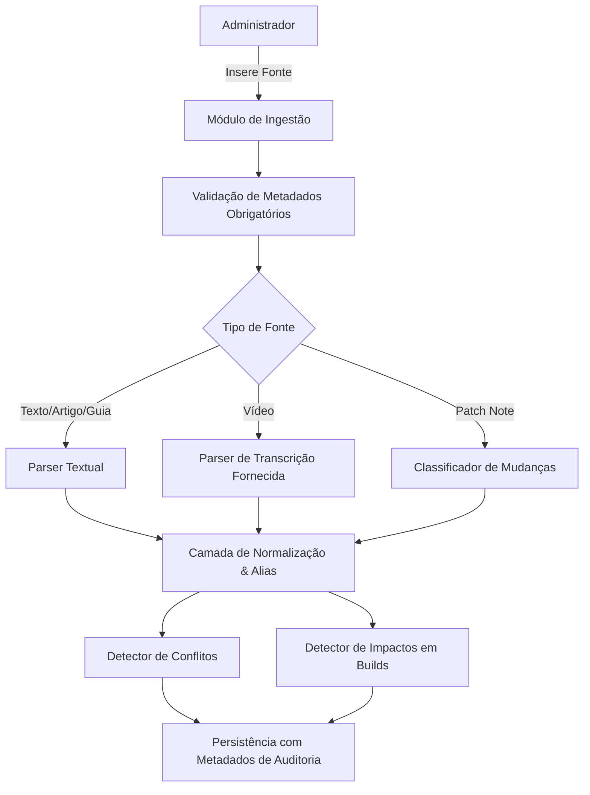

# POE2 BUILD HUB — Pipeline de Ingestão de Conteúdo

## 1. Fluxo de Ingestão

## 2. Regras de Processamento de Vídeos
1. Se a transcrição textual ou resumo oficial do vídeo for fornecido pelo administrador:
   - Extrair apenas o que consta na transcrição;
   - Vincular cada ponto à minutagem ou trecho citado quando disponível.
2. Se a transcrição **não** estiver disponível:
   - Exibir explicitamente: `"Não foi possível extrair o conteúdo textual desta fonte."`
   - **Proibido inventar** ou presumir o conteúdo do vídeo a partir do título.

## 3. Extração e Normalização
- Nomes populares ou siglas (ex: "LA", "Lightning Arrow", "Lightning Arrow Build") são associados ao nome canônico normalizado `Lightning Arrow`.
- O texto original é sempre preservado no campo `raw_text` para garantir auditoria fidedigna.
